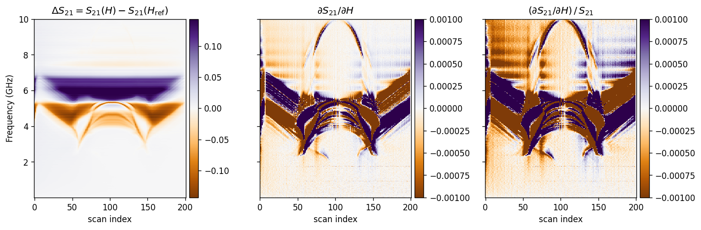
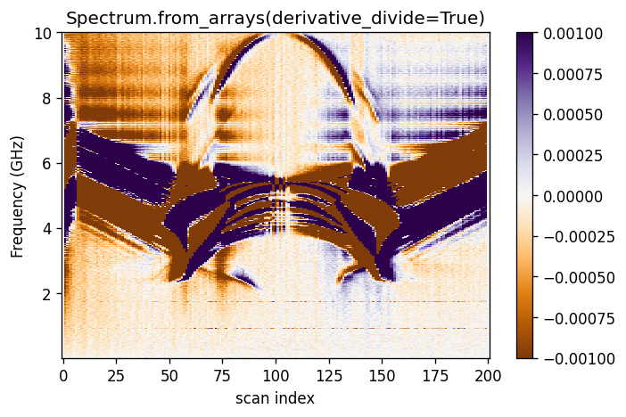
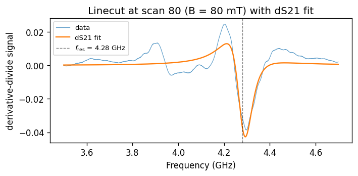
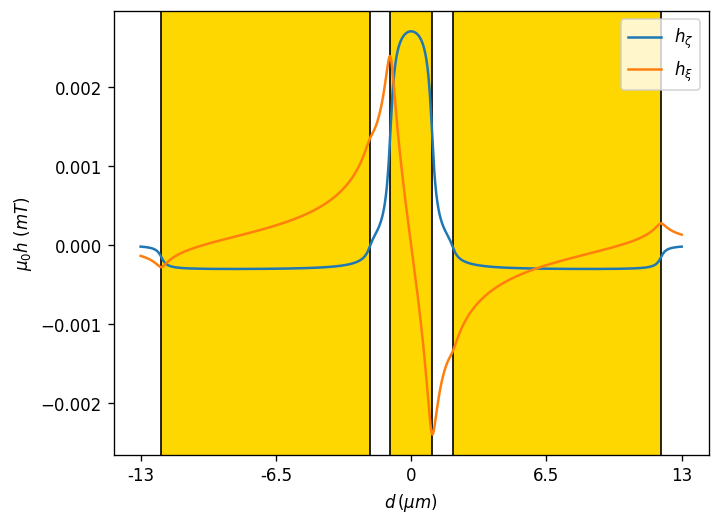
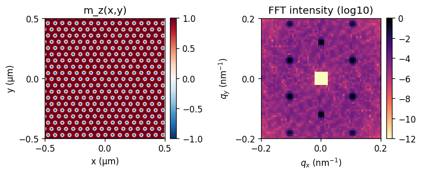

# drlib

A Python toolkit for **ferromagnetic-resonance (FMR) spectroscopy**,
**coplanar-waveguide (CPW) field modelling**, and **REXS-style
reciprocal-space simulation** of magnetic textures such as skyrmion
lattices and helical states.

`drlib` was written to analyse 2-D FMR S-parameter measurements (frequency
vs. magnetic field) produced by a LabView VI, but every analysis primitive
(`derivative_divide`, `dS21`, `Linecut.one_peak`, …) is reusable on any
2-D dataset — and the new `Spectrum.from_arrays` / `Spectrum.from_mat`
constructors let you feed it raw NumPy arrays or a flat directory of
`.mat` files (the bundled `PRJCT/Data/` dataset uses this simple layout).

---

## Features

- **`Spectrum`** — load LabView-style FMR data **or** in-memory arrays,
  apply derivative-divide / derivative / ΔS21 background correction,
  plot / zoom / denoise.
- **`Linecut`** — extract a constant-field cut and fit 1, 2, or 3 peaks
  with the `dS21` / `Lorentzian` complex line shapes via `lmfit`.
- **`CPW`** — analytical Biot–Savart magnetic field above a
  signal-gap-ground coplanar waveguide, plus its k-space excitation spectrum.
- **`REXS2D`** — generate skyrmion-lattice / helical / coexistence
  textures and their FFT intensity, mimicking REXS.
- **`compare_techniques`** — one-call comparison plot of the three FMR
  background-correction techniques side by side.
- Self-contained helpers: `derivative`, `derivative_divide`, `FFT_1D`,
  `B_BS_analytic`, `set_size`, `safe_style`, `timeit`,
  `load_mat_dataset`, `read_measurement_txt`.

---

## Installation

```bash
git clone https://github.com/<your-user>/drlib.git
cd drlib
pip install -e .
```

Or, with the dependencies pinned in `requirements.txt`:

```bash
pip install -r requirements.txt
```

### Dependencies

- `numpy`, `scipy`, `matplotlib`, `pandas`, `lmfit`

---

## Quickstart — using the bundled reference dataset

The repo ships with a small FMR reference dataset under `PRJCT/Data/`
(four `.mat` files, see `DATA_SHAPES.md` for the convention). The
five-line tour below uses it directly:

```python
from drlib import Spectrum, Linecut, compare_techniques, load_mat_dataset

freq, field, mlin, mlin_ref = load_mat_dataset(r"PRJCT/Data")

# 1. Compare the three background-correction techniques side by side
compare_techniques(freq, field, mlin, saturation_index=200)
```



```python
# 2. Build a Spectrum from the loaded arrays (or use Spectrum.from_mat)
spec = Spectrum.from_arrays(
    freq, field, mlin, mlin_ref,
    saturation=200,
    derivative_divide=True,
)
print(spec)
# <drlib.Spectrum S21 N_field=201 N_freq=20001, B=[0,200],
#  f=[1e+07,1e+10] Hz, mode='derivative_divide', saturation=200>
```



```python
# 3. Extract a Linecut and fit a dS21 peak
cut = Linecut(cut=80, Spectrum=spec, frequencies=(3.5e9, 4.7e9))
freq_cut, fit, params, report = cut.one_peak(resonance=[4.2e9])
print(f"fres = {params[2]*1e-9:.2f} GHz   Df = {params[3]*1e-6:.0f} MHz")
# fres = 4.28 GHz   Df = 122 MHz
```



```python
# 4. Model the CPW excitation
from drlib import CPW
cpw = CPW(current=10e-3, signal_line=2e-6, gap=1e-6,
          ground=10e-6, thickness=200e-9)
cpw.get_Kspectrum(K_range=(0, 5), style=None)
```



```python
# 5. Simulate a skyrmion-lattice REXS pattern
from drlib import REXS2D
sim = REXS2D(N=256, L_um=1.0, pitch_nm=60.0, a_nm=60.0, K=1)
sim.build_skyrmion_mz()
sim.plot(qmax_nm1=0.2)
```



For a complete walk-through (including 2-/3-peak fits, `scatter_plot`
overlays, helical states, and coexistence textures), open
[`tutorial.ipynb`](tutorial.ipynb).

---

## Loading your own data

`drlib` does **not** hard-code any directory. Three input paths are
supported, choose whichever matches your workflow:

| Constructor | When to use | Doc |
|-------------|-------------|-----|
| `Spectrum(path=r"…")`             | LabView VI folder layout (sub-folders `measurement/MEAS/`, `measurement/store/MEAS/<S>/`, …) | `DATA_SHAPES.md §1` |
| `Spectrum.from_mat(directory)`    | Flat directory of four `.mat` files (`freq.mat`, `MLIN.mat`, `MLIN_REF.mat`, `sample_field.mat`) | `DATA_SHAPES.md §1.bis` |
| `Spectrum.from_arrays(freq, field, mlin, mlin_ref)` | You already have NumPy arrays | `DATA_SHAPES.md §1.bis` |

The exact array shapes each entry point expects are listed in
[`DATA_SHAPES.md`](DATA_SHAPES.md). All three constructors converge on
the same internal representation, so every downstream method
(`plot`, `zoom_plot`, `scatter_plot`, `Linecut`, arithmetic, …) is
identical regardless of how the spectrum was built.

---

## Package layout

```
DrLib/
├── README.md
├── DATA_SHAPES.md
├── LICENSE
├── requirements.txt
├── pyproject.toml
├── tutorial.ipynb         – guided walk-through on the bundled data
├── docs_assets/           – figures rendered for this README
└── drlib/
    ├── __init__.py        – public API
    ├── utils.py           – set_size, timeit, safe_style, read_measurement_txt
    ├── math_tools.py      – derivative, derivative_divide, FFT_1D
    ├── models.py          – dS21, Lorentzian
    ├── io.py              – load_mat_dataset (lightweight .mat loader)
    ├── field.py           – Biot–Savart helpers + CPW class
    ├── spectrum.py        – Spectrum class + compare_techniques
    ├── linecut.py         – Linecut class (peak fitting)
    └── rexs.py            – REXS2D simulator
```

Each module ships with NumPy-style docstrings so `help(drlib.Spectrum)`,
`drlib.Linecut?` (IPython) and Sphinx all just work.

---

## API reference at a glance

### Top-level functions

| Function | Purpose |
|----------|---------|
| `load_mat_dataset(directory)` | Read `freq.mat` / `MLIN.mat` / `MLIN_REF.mat` / `sample_field.mat` from a flat directory. Returns `(freq, field, mlin, mlin_ref)`. |
| `compare_techniques(freq, field, mlin, …)` | Plot ΔS21, derivative, and derivative-divide side by side. |
| `derivative(X, Y, Z, axis, modulation_amp)` | Central-difference derivative of a 2-D array along `axis`. |
| `derivative_divide(X, Y, Z, axis, modulation_amp, average)` | Derivative-divide background correction (Maier-Flaig 2017). |
| `FFT_1D(array, dx, zero_pad=None)` | 1-D FFT with shifted angular-wavenumber axis. |
| `dS21(x, A, Psi, fres, Df, mod, Msat, H0)` | Modulation-broadened complex S21 line shape (Maeda 2018). |
| `Lorentzian(x, A, Psi, fres, Df, mod, Msat, H0)` | Bare complex Lorentzian; same parameter order as `dS21`. |
| `B_BS_analytic(x0, z0, thickness, width, I, direction)` | Closed-form Biot–Savart field of a rectangular wire. |
| `set_size(width, fraction)` | LaTeX-friendly `(width, height)` figure size in inches. |
| `safe_style(name)` | `plt.style.use` with graceful fallback to `"default"`. |
| `timeit(f)` | Decorator that prints how long a call takes. |

### Classes

| Class | Constructors | Key methods |
|-------|--------------|-------------|
| `Spectrum` | `Spectrum(path)`, `Spectrum.from_mat(dir)`, `Spectrum.from_arrays(freq, field, mlin, mlin_ref)` | `plot`, `zoom_plot`, `zoom_cycle_plot`, `scatter_plot`, `scatter_fit`, `denoise_spectrum`, arithmetic (`+`, `-`, `*`, `/`) |
| `Linecut` | `Linecut(cut, Spectrum, frequencies)` | `plot`, `one_peak`, `two_peak`, `three_peak`, `denoising` |
| `CPW`     | `CPW(current, signal_line, gap, ground, thickness)` | `get_Bdistribution`, `get_Bspectrum`, `get_Kspectrum` |
| `REXS2D`  | `REXS2D(N, L_um, pitch_nm, …)` | `build_skyrmion_mz`, `build_helical_mz`, `build_helical_multidomain_mz`, `build_skyrmion_plus_helical_coexistence`, `compute_qspace`, `plot`, `summary`, `savefig` |

For full parameter lists and physics context, every public callable has
a NumPy-style docstring — call `help(...)` or `?` in IPython.

---

## Tutorial

[`tutorial.ipynb`](tutorial.ipynb) runs the whole pipeline end-to-end on
the bundled `PRJCT/Data/` dataset (no measurement folder required).

---

## Citing

If `drlib` helps your research, please cite the two underlying papers:

- L. Maier-Flaig *et al.*, *"Analysis of broadband ferromagnetic resonance
  in the frequency domain"*, arXiv:1705.05694.
- Y. Maeda *et al.*, *AIP Adv.* **8**, 075302 (2018).

---

## License

MIT — see [`LICENSE`](LICENSE).

## Author

Sina Mehboodi
